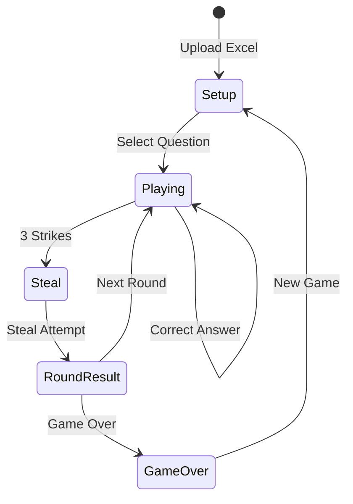

# Family Feud Team-Building Game - PRD and Implementation Plan

---

## 1. Product Overview

A single-page web application that replicates the Family Feud game-show experience for team-building events. A host controls the game on a shared screen (laptop connected to TV), uploading questions from an Excel file, inputting player answers, and triggering board reveals with sound effects.

---

## 2. User Roles

| Role | Description |

|------|-------------|

| **Host** | Runs the game: uploads questions, enters answers, awards points, triggers sounds, ends game. |

| **Players** | Two teams watching the shared screen; they answer verbally (no device interaction). |

---

## 3. Core Features

### 3.1 Excel Upload

- **Upload button** in host controls.
- Accepts `.xlsx` file (single sheet).
- Parses with SheetJS (`xlsx` library).
- Validates columns: `questionId`, `questionText`, `answerText`, `points`, `aliases`.
- Shows preview (question count, answer count) before loading.

### 3.2 Game Board UI (inspired by Family Feud set)

- **Top center**: Round pot (points accumulated this round).
- **Main board**: 2-column grid (up to 8 answer slots). Each slot shows:
  - Slot number badge (left)
  - Hidden/revealed answer text (center)
  - Points (right, shown on reveal)
- **Side panels**: Team A score (left), Team B score (right), with editable team names.
- **Strike indicators**: 3 "X" icons per team; light up on wrong answer.
- **LED dot pattern background** (CSS gradient) for stage feel.

### 3.3 Host Controls Panel

- **Select Question** dropdown (from uploaded questions).
- **Answer Input** text field + **Submit** button.
- **Mark Correct / Wrong** (if fuzzy match needed).
- **Strike** button (manual override).
- **Reveal All** button (end-of-round reveal).
- **Next Round** button (reset strikes, pot, reveals; pick next question).
- **Game Over** button (show final score screen).
- **New Game** button (reset everything).
- **Team Name** edit fields.

### 3.4 Game Logic (State Machine)



**State variables**:

- `phase`: `"setup" | "playing" | "steal" | "roundResult" | "gameOver"`
- `activeTeam`: `"A" | "B"`
- `teamTotals`: `{ A: number, B: number }`
- `teamNames`: `{ A: string, B: string }`
- `roundPot`: number
- `roundStrikes`: number
- `currentQuestionId`: string | null
- `revealedAnswerIds`: Set of string

**Rules**:

- **Correct answer** (playing): reveal slot, `roundPot += points`.
- **Wrong answer** (playing): `roundStrikes++`; if 3 → switch to `steal` phase, swap `activeTeam`.
- **Steal phase**: one guess only.
  - Correct → stealing team wins `roundPot`.
  - Wrong → original team wins `roundPot`.
- **Round Result**: show winner, host clicks Next Round.
- **Game Over**: freeze inputs, show final scores on board.

### 3.5 Sound Effects

- Host provides sound files (placed in `public/sounds/`):
  - `ding.mp3` (correct answer reveal)
  - `buzzer.mp3` (wrong answer / strike)
  - `applause.mp3` (round win / game over)
- Played via HTML5 `Audio` API on relevant events.

### 3.6 Animations

- **Flip reveal**: CSS 3D transform on answer slot (card flip).
- **Strike X**: scale + fade-in.
- **Score increment**: number counter animation.
- **Game Over**: fade transition to final score view.

---

## 4. Data Model

### 4.1 Excel Schema (single sheet)

| Column | Type | Required | Description |

|--------|------|----------|-------------|

| questionId | string | Yes | Groups answers (e.g., `Q1`) |

| questionText | string | Yes | The survey question |

| answerText | string | Yes | One accepted answer |

| points | number | Yes | Points for this answer |

| aliases | string | No | Comma-separated synonyms |

### 4.2 Parsed In-App Model

```typescript
interface Answer {
  id: string;          // generated: `${questionId}_${index}`
  text: string;
  points: number;
  aliases: string[];
}

interface Question {
  id: string;
  text: string;
  answers: Answer[];   // sorted by points descending
}

interface GameState {
  phase: "setup" | "playing" | "steal" | "roundResult" | "gameOver";
  questions: Question[];
  currentQuestionId: string | null;
  activeTeam: "A" | "B";
  teamTotals: { A: number; B: number };
  teamNames: { A: string; B: string };
  roundPot: number;
  roundStrikes: number;
  revealedAnswerIds: Set<string>;
  stealOriginTeam: "A" | "B" | null;
}
```

---

## 5. Tech Stack

| Layer | Choice |

|-------|--------|

| Framework | React 18 + TypeScript |

| Build | Vite |

| Styling | CSS Modules or plain CSS (no Tailwind) |

| Excel parsing | `xlsx` (SheetJS) |

| State | React Context + useReducer |

| Sound | HTML5 Audio API |

| Hosting | Local (`npm run dev`) |

---

## 6. File Structure

```
/family-feud-game
├── index.html
├── package.json
├── tsconfig.json
├── vite.config.ts
├── public/
│   └── sounds/
│       ├── ding.mp3        (user-provided)
│       ├── buzzer.mp3      (user-provided)
│       └── applause.mp3    (user-provided)
└── src/
    ├── main.tsx
    ├── App.tsx
    ├── App.css
    ├── types.ts            (Answer, Question, GameState)
    ├── context/
    │   └── GameContext.tsx (state + reducer + provider)
    ├── utils/
    │   ├── excelParser.ts  (parse xlsx → Question[])
    │   └── matchAnswer.ts  (fuzzy match input to answers)
    ├── hooks/
    │   └── useSound.ts     (play sound helper)
    └── components/
        ├── Board/
        │   ├── Board.tsx
        │   ├── Board.css
        │   ├── AnswerSlot.tsx
        │   ├── ScorePanel.tsx
        │   ├── StrikeIndicator.tsx
        │   └── RoundPot.tsx
        ├── HostControls/
        │   ├── HostControls.tsx
        │   ├── HostControls.css
        │   ├── ExcelUpload.tsx
        │   ├── QuestionSelect.tsx
        │   └── AnswerInput.tsx
        └── GameOver/
            ├── GameOver.tsx
            └── GameOver.css
```

---

## 7. Implementation Plan (ordered tasks)

### Phase 1: Project Setup

1. Scaffold Vite + React + TypeScript project.
2. Install `xlsx` dependency.
3. Create folder structure and placeholder files.
4. Add `public/sounds/` folder with placeholder `.mp3` files (user replaces later).

### Phase 2: Data Layer

5. Define TypeScript types in `types.ts`.
6. Implement `excelParser.ts` (read file, validate, return `Question[]`).
7. Implement `matchAnswer.ts` (normalize input, check against answer text + aliases).
8. Create `GameContext.tsx` with reducer handling all state transitions.

### Phase 3: Board UI

9. Build `Board.tsx` layout (oval frame, LED dots via CSS gradient).
10. Build `AnswerSlot.tsx` with flip animation (CSS 3D transform).
11. Build `ScorePanel.tsx` (team name, total score).
12. Build `StrikeIndicator.tsx` (3 X icons, light up on strike).
13. Build `RoundPot.tsx` (top center score display).

### Phase 4: Host Controls

14. Build `ExcelUpload.tsx` (file input, parse, preview, confirm).
15. Build `QuestionSelect.tsx` (dropdown of loaded questions).
16. Build `AnswerInput.tsx` (text input + submit).
17. Build `HostControls.tsx` (assemble above + Strike, Reveal All, Next Round, Game Over buttons).

### Phase 5: Game Logic Integration

18. Wire host controls to dispatch actions to GameContext.
19. Implement steal phase UI (prompt, one-guess flow).
20. Implement round result display (who won pot).

### Phase 6: Sound and Polish

21. Implement `useSound.ts` hook.
22. Trigger sounds on reveal (ding), strike (buzzer), round/game win (applause).
23. Add score counter animation.
24. Style polish (colors, gradients, responsive sizing for TV display).

### Phase 7: Game Over Screen

25. Build `GameOver.tsx` (final scores, winner banner, New Game button).
26. Integrate into Board (swap content when phase is `gameOver`).

### Phase 8: Testing and QA

27. Manual test: upload Excel, play full game, verify steal logic.
28. Edge cases: empty file, duplicate answers, all answers revealed.
29. Final styling pass.

---

## 8. Acceptance Criteria

- [ ] Host can upload an Excel file and see a preview before loading.
- [ ] Board displays up to 8 answer slots in 2 columns.
- [ ] Correct answer reveals slot with flip animation and ding sound.
- [ ] Wrong answer increments strike indicator and plays buzzer.
- [ ] After 3 strikes, game switches to steal phase for other team.
- [ ] Steal success awards pot to stealing team; failure awards to original team.
- [ ] Team names are editable.
- [ ] Team scores update correctly after each round.
- [ ] Game Over button shows final scores on the board.
- [ ] New Game resets all state.
- [ ] App runs locally via `npm run dev`.

---

## 9. Out of Scope (for MVP)

- Player devices / buzzers
- Fast Money bonus round
- Persistent storage / database
- Multiplayer networking
- Mobile-specific layout